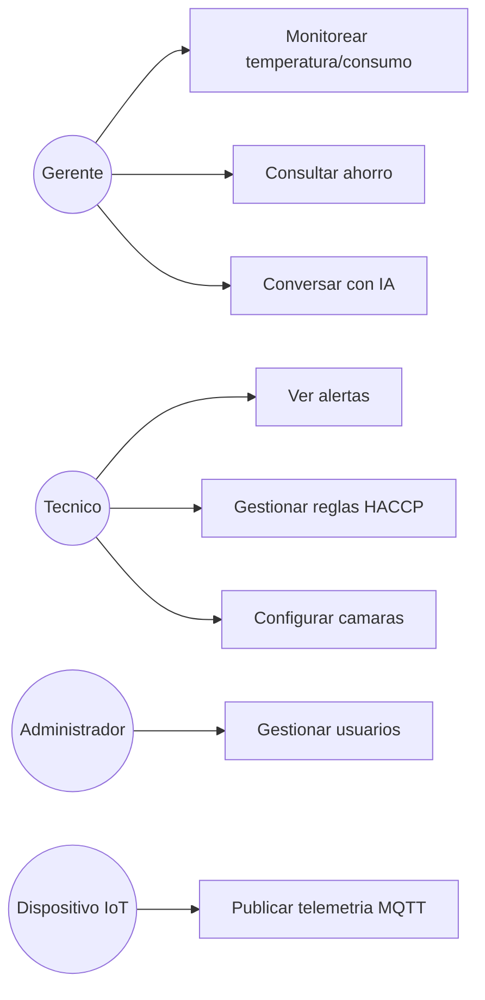

# Casos de uso

> **Estado:** Borrador
> **Área SWEBOK:** KA1 — Software Requirements
> **Responsable:** Equipo completo
> **Última actualización:** 2026-10-06
> **Documentos relacionados:** [Requerimientos](requerimientos.md)

## 1. Actores

| Actor | Descripción |
|-------|-------------|
| Gerente | Consulta indicadores, ahorro y reportes; usa el asistente IA. |
| Técnico | Revisa alertas, configura cámaras y reglas HACCP. |
| Administrador | Gestiona usuarios, empresas y roles. |
| Dispositivo IoT | Publica telemetría (actor secundario/no humano). |
| Gemini (sistema externo) | Responde consultas en lenguaje natural. |

## 2. Diagrama de casos de uso

## 3. Especificación resumida

### CU-01 Monitorear temperatura y consumo
- **Actor:** Gerente. **Precondición:** sesión iniciada.
- **Flujo:** el dashboard consulta la API → muestra series y gráficos en tiempo real.
- **Postcondición:** indicadores actualizados.

### CU-02 Ver alertas
- **Actor:** Técnico. **Precondición:** existen alertas generadas.
- **Flujo:** lista de alertas HACCP/predictivas con severidad, estado y fecha.

### CU-03 Consultar ahorro potencial
- **Actor:** Gerente. **Flujo:** recomendaciones (`saving_recommendation`) con
  ahorro estimado en CLP y justificación.

### CU-04 Conversar con el asistente IA
- **Actor:** Gerente. **Flujo:** pregunta → contexto del historial → respuesta de Gemini.

### CU-05 Gestionar reglas HACCP
- **Actor:** Técnico. **Flujo:** CRUD de `haccp_rules` (umbrales, tolerancia, severidad).

### CU-06 Configurar cámaras
- **Actor:** Técnico. **Flujo:** CRUD de cámaras y sensores asociados.

### CU-07 Gestionar usuarios
- **Actor:** Administrador. **Flujo:** CRUD de usuarios, roles y preferencias.

### CU-08 Publicar telemetría MQTT
- **Actor:** Dispositivo IoT. **Flujo:** publica cada 10 s en `sensor/raw`.

## 4. Trazabilidad

Cada caso de uso se enlaza a los requisitos RF-01…RF-10 en
[`requerimientos.md`](requerimientos.md) (matriz completa pendiente).
