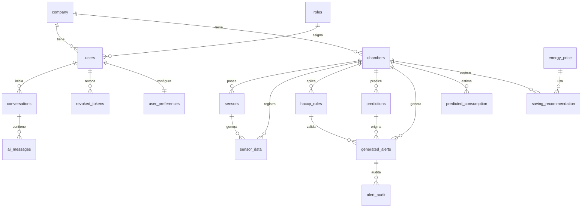

# Modelo de datos

> **Estado:** Borrador
> **Área SWEBOK:** KA3 — Software Design
> **Responsable:** Diego Curiqueo
> **Última actualización:** 2026-10-06
> **Documentos relacionados:** [Arquitectura](../02-arquitectura/arquitectura.md)

## 1. Propósito

Describir el diseño detallado de la capa de datos: entidades, relaciones,
restricciones e índices. El esquema se define en
[`database/init.sql`](../../database/init.sql).

## 2. Dominios

- **Configuración:** `company`, `roles`, `users`, `chambers`, `sensors`.
- **Series de tiempo (TimescaleDB):** `sensor_data` (hypertable por `timestamp`).
- **HACCP:** `haccp_rules`, `generated_alerts`, `alert_audit`.
- **Predictivo:** `predictions`.
- **Optimización:** `energy_price`, `predicted_consumption`, `saving_recommendation`.
- **Ingesta / auditoría:** `ingestion_log`, `reports`.
- **IA:** `conversations`, `ai_messages`.
- **Seguridad:** `revoked_tokens`, `user_preferences`.

## 3. Diagrama entidad-relación (resumido)

## 4. Restricciones e integridad

- Claves primarias UUID/serial; claves foráneas con `ON DELETE CASCADE` (o
  `SET NULL` según corresponda).
- Dominios controlados por `CHECK`: `severity`, `status` de alertas,
  `processing_status`, `risk_level`, `sender`.
- Índices en claves foráneas de consulta frecuente y en
  `sensor_data.timestamp DESC`.

## 5. Diseño detallado (pendiente)

- Diccionario de datos completo (tipo, longitud, nulabilidad, default).
- Estrategia de retención y compresión de hypertables.
- Continuas agregadas (continuous aggregates) para reportes.
